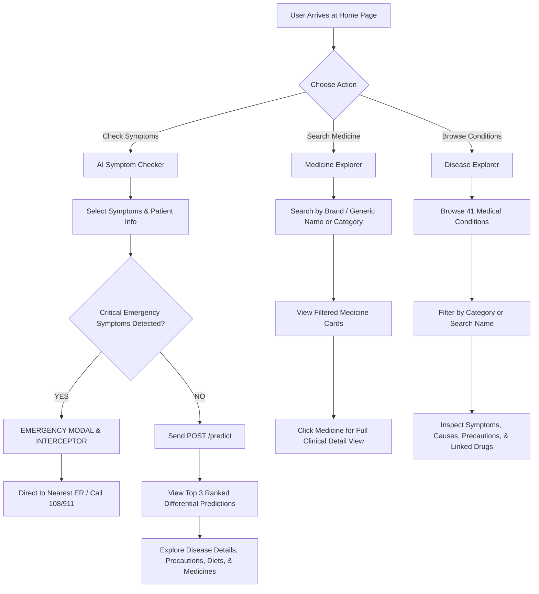

# MediAssist — Application Flow (`appflow.md`)

## 1. High-Level Navigation Architecture

---

## 2. Detailed User Journey Flows

### 2.1 Journey A: AI Symptom Checker & Triage

1. **Step 1: Initiation**
   - User navigates to `/symptom-checker`.
   - The UI fetches the canonical list of 132 valid symptoms from `GET /symptoms`.
2. **Step 2: Patient Context Input**
   - User inputs optional patient context:
     - **Age** (years)
     - **Weight** (kg)
     - **Duration** (< 24 hrs, 1-3 days, 1+ week)
     - **Severity Level** (Mild, Moderate, Severe)
3. **Step 3: Interactive Symptom Selection**
   - Categorized pill selector (General, Respiratory, Gastrointestinal, Skin, Musculoskeletal, Neurological).
   - Fast instant search filter to quickly add symptoms (e.g. typing "fever", "chest", "nausea").
   - Live badge counter of selected symptoms (Minimum 1 required, 3–6 recommended for high accuracy).
4. **Step 4: Emergency Interception Guardrail**
   - Client checks against the **Emergency Symptom Registry**:
     - *Severe chest pain, breathlessness at rest, sudden paralysis, loss of consciousness, severe hemorrhage*.
   - If detected:
     - **Flow is immediately paused**.
     - An urgent amber/red alert modal triggers with emergency hotlines.
     - User must explicitly acknowledge the emergency warning before proceeding with non-emergency educational inquiry.
5. **Step 5: Machine Learning Execution & Analysis**
   - Client executes `POST /predict` with `{ "symptoms": [...] }`.
   - FastAPI loads the feature vector into XGBoost, retrieves probabilities, and queries local MongoDB for associated condition details and medications.
6. **Step 6: Comprehensive Differential Result View**
   - **Confidence Hierarchy**: Top 3 ranked diseases displayed with percentage bars (e.g., *Influenza 84.5%*, *Common Cold 62.1%*, *Viral Fever 51.0%*).
   - **Clinical Overview**: Summary explanation of the top condition.
   - **Four-Pillar Care Breakdown**:
     1. **Precautions**: Specific behavioral guardrails (e.g., isolate, hydrate).
     2. **Nutritional Guidance**: Recommended dietary items.
     3. **Lifestyle & Workout**: Suitable physical activities or mandatory bed rest.
     4. **Associated Medications**: Verified pharmaceuticals with active ingredients, price, and prescription alerts.
   - **Persistent Educational Disclaimer** displayed prominently.

---

### 2.2 Journey B: Medicine Explorer & Drug Directory

1. **Step 1: Access Explorer**
   - User visits `/medicines`.
   - UI calls `GET /medicines?limit=24&skip=0`.
2. **Step 2: Search & Filter**
   - Search input debounce (300ms) triggering `GET /medicines?search={query}`.
   - Filters: Prescription Required (`Yes` / `No`), Price range, and Therapeutic Category.
3. **Step 3: Medicine Detail Inspection**
   - User clicks a medicine card to open the detailed page (`/medicines/[id]`) or slide-over drawer.
   - Displays:
     - Brand Name & Manufacturer
     - Generic Chemical Composition
     - Prescription Necessity Badge (Rx Required / OTC)
     - Therapeutic indications & drug contents
     - Indicative retail price

---

### 2.3 Journey C: Disease Explorer & Health Encyclopedia

1. **Step 1: Access Explorer**
   - User visits `/diseases`.
   - UI queries `GET /diseases?limit=50`.
2. **Step 2: Browse & Filter**
   - Alphabetical index and search bar.
   - Disease cards showing name, brief description snippet, and typical key symptoms.
3. **Step 3: Deep Dive View**
   - User selects a disease to view `/diseases/[id]`.
   - Complete symptom fingerprint (all 132-indicator flags associated with this condition).
   - 4-step precautionary guidelines.
   - Tailored diet & workout advice.
   - Directly linked therapeutic medicine recommendations.

---

## 3. Error Handling & Edge Cases

| Scenario | System Behavior | UI Feedback |
| :--- | :--- | :--- |
| **0 symptoms selected** | Submit button disabled | Tooltip: "Please select at least 1 symptom to run analysis" |
| **No disease matches / zero confidence** | ML returns flat uniform probabilities | Card: "Symptoms do not match a single clear profile. Please consult a clinician." |
| **Backend API Unreachable** | Graceful fallback catch block | "Unable to connect to MediAssist health servers. Please check your internet." |
| **Invalid Disease/Medicine ID** | 404 HTTP Exception from FastAPI | Clean 404 page with "Return to Explorer" button |
| **Emergency Symptom Trigger** | Client-side rule check intercepts API call | High-priority Emergency Modal with 108/911 helpline dialer |
